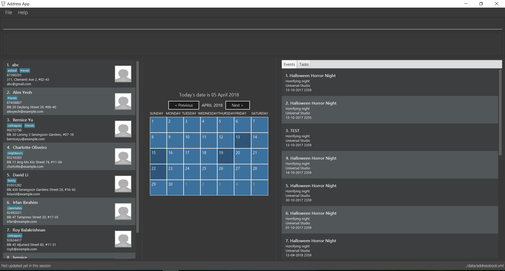

= BizConnect Journal
ifdef::env-github,env-browser[:relfileprefix: docs/]

https://travis-ci.org/CS2103JAN2018-T15-B4/main[image:https://travis-ci.org/CS2103JAN2018-T15-B4/main.svg?branch=master[Build Status]]
https://coveralls.io/github/CS2103JAN2018-T15-B4/main[image:https://coveralls.io/repos/github/CS2103JAN2018-T15-B4/main/badge.svg?branch=master[Coverage Status]]

ifdef::env-github[]

endif::[]

ifndef::env-github[]
image::images/Ui.png[width="600"]
endif::[]

* This is a desktop Address Book application called BizConnect Journal. It has a GUI but most of the user interactions happen using a CLI (Command Line Interface).
* BizConnect Journal is a powerful Address Book that allows for easy and efficient handling of business contacts.
* BizConnect Journal is catered towards businessmen users and travelers who spend most of their time on computers and prefer CLI.
* Some useful features include:
** Fast and easy searches in large contact lists.
** Export functionality enables easy portability of addressbook data in XML or CSV (Google contacts) format.
** Calendar and Event features for easier tracking of schedule.
** Task features to organize personal daily activities.
** Display Picture enhancement to allow visual recognition aid of contacts.
** Conversion between monetary currencies when traveling in foreign countries.

== Site Map

* <<UserGuide#, User Guide>>
* <<DeveloperGuide#, Developer Guide>>
* <<AboutUs#, About Us>>
* <<ContactUs#, Contact Us>>

== Acknowledgements

* This application was built based on https://github.com/se-edu/addressbook-level4[Address Book (Level 4)], an initiative of the https://se-edu.github.io/[SE-EDU team].
* Some parts of this sample application were inspired by the excellent http://code.makery.ch/library/javafx-8-tutorial/[Java FX tutorial] by
_Marco Jakob_.
* Libraries used: https://github.com/TomasMikula/EasyBind[EasyBind], https://github.com/TestFX/TestFX[TextFX], https://bitbucket.org/controlsfx/controlsfx/[ControlsFX], https://github.com/FasterXML/jackson[Jackson], https://github.com/google/guava[Guava], https://github.com/junit-team/junit4[JUnit4]

== Licence : link:LICENSE[MIT]
